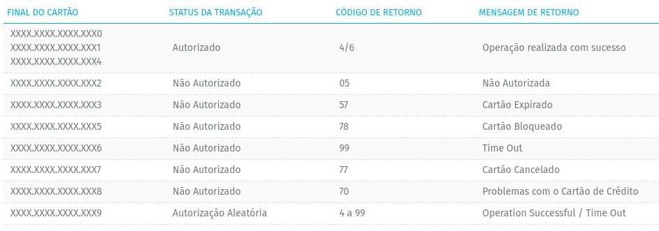

# Sistema de Gerenciamento de Pedidos - Desafio Tech Challenge - Módulo 4

Este repositório refere-se ao serviço de pedidos. No total, o projeto envolve 4 serviços, sendo eles:

1. Cliente
2. Produto
3. Pedido
4. Logística

Este serviço é responsável pelo processamento dos pedidos, desde a criação até a conclusão. Isto inclui receber os pedidos dos clientes, processar pagamento e coordenar com o microsserviço de logística.

## Tecnologias

* Spring Boot para a estrutura do serviço
* Spring Data JPA para manipulação de dados dos pedidos
* Spring Cloud Stream para comunicação baseada em eventos com outros microsserviços
* PostgreSQL para persistência 

## Pagamento

As integrações de pagamento será realizado por mock.

O código foi separado para que futuramente seja mais fácil realizar uma integração real, no entanto, no momento o retorno de pagamento é dado como na imagem abaixo considerando o final do cartão.

Está imagem foi extraída da documentação da [API E-commerce Cielo](https://developercielo.github.io/manual/cielo-ecommerce#environment).